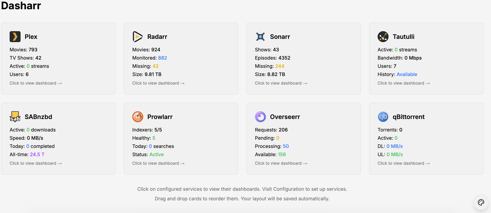

# Dasharr

A unified media and network dashboard that consolidates your Plex, Jellyfin, Radarr, Sonarr, Bazarr, UniFi Network, and other services into one beautiful interface.



## Features

- **Real-time Statistics** - Monitor active streams, downloads, and system health
- **Multi-Instance Support** - Configure multiple instances of the same service (e.g., 1080p & 4K Radarr instances)
- **Beautiful Interface** - Modern, responsive design with multiple themes  
- **Easy Configuration** - Web-based setup with no config files needed
- **Docker Ready** - Simple deployment with Docker Compose
- **Service Integration** - Supports Plex, Jellyfin, Tautulli, Overseerr, Jellyseerr, Radarr, Sonarr, Bazarr, SABnzbd, qBittorrent, Prowlarr, and UniFi Network

## Quick Start

### Using Docker Run

**Recommended - Using a Docker Volume (no permission issues):**
```bash
docker run -d \
  --name dasharr \
  -p 3000:3000 \
  -v dasharr_config:/app/config \
  schenanigans/dasharr:latest
```

**Alternative - Using a bind mount:**
```bash
# Create config directory with proper permissions
mkdir -p ./config && chmod 777 ./config

# Run the container
docker run -d \
  --name dasharr \
  -p 3000:3000 \
  -v ./config:/app/config \
  schenanigans/dasharr:latest
```

### Using Docker Compose

```yaml
services:
  dasharr:
    image: schenanigans/dasharr:latest
    container_name: dasharr
    ports:
      - "3000:3000"
    volumes:
      - dasharr_config:/app/config  # or use bind mount: ./config:/app/config
    environment:
      - PUID=1000  # Optional: defaults to 1000
      - PGID=1000  # Optional: defaults to 1000
      # - DASHARR_SELF_SIGNED=false  # Optional: set to false to require valid certificates
    restart: unless-stopped
    healthcheck:
      test: ["CMD", "wget", "-q", "--spider", "http://localhost:3000"]
      interval: 30s
      timeout: 10s
      retries: 3
      start_period: 40s
```

Then visit http://localhost:3000 to start configuring your services.

## Configuration

Dasharr supports two configuration methods:

### Web-Based Configuration (Recommended)
1. Navigate to http://localhost:3000/admin
2. Add your services by clicking "Add Service"
3. Enter your service URLs and API keys
4. Click "Test Connection" and "Save"
5. For multiple instances of the same service, repeat the process

### Environment Variables
You can also configure services via environment variables. See the [Docker Hub page](https://hub.docker.com/r/schenanigans/dasharr) for all available options.

**Note:** Environment variables currently support only single instances per service type. For multiple instances, use the web UI configuration.

**Note:** Environment variables take precedence over web-based configuration. If both are set, the environment variable values will be used.

## Documentation

Full documentation is available at [https://dasharr.io](https://dasharr.io)

## Supported Services

- **Plex** - Media server monitoring
- **Jellyfin** - Open-source media server
- **Tautulli** - Plex statistics and monitoring
- **Overseerr** - Request management for Plex
- **Jellyseerr** - Request management for Jellyfin
- **Radarr** - Movie management
- **Sonarr** - TV show management
- **Bazarr** - Subtitle management
- **Prowlarr** - Indexer management
- **SABnzbd** - Usenet downloader
- **qBittorrent** - BitTorrent client
- **UniFi Network** - Multi-site network monitoring and management

## Security & Privacy

Dasharr is designed with security and privacy in mind:
- **Read-Only Access** - Only reads data from your services, never modifies
- **Transparent API Usage** - See [api-requests-made.md](api-requests-made.md) for all API calls
- **Network Isolation** - Can be run on a dedicated Docker network for enhanced security

## Support

- Documentation: https://dasharr.io
- Docker Hub: https://hub.docker.com/r/schenanigans/dasharr
- GitHub: https://github.com/taslabs-net/dasharr
- Buy Me a Coffee: https://coff.ee/taslabs
